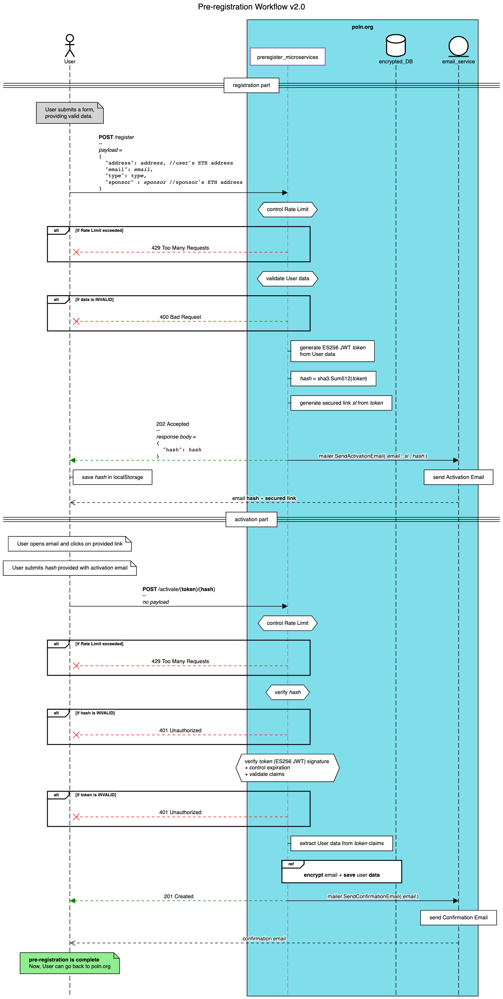

# Waitlist


Transparency stands as a cornerstone in the emerging world of web3 projects.


PoLN embodies this ethos, emphasizing the importance of openness and accountability. In a landscape where the trust of stakeholders is paramount, maintaining public visibility into source code becomes not just an ethical choice, but a strategic one.


The choice to keep PoLN's source code in public repositories isn't merely about signaling honesty. It fosters a collaborative environment, encouraging community contributions, peer reviews, and shared innovation.


By doing so, PoLN aims to create a thriving ecosystem, underpinned by shared values and collaborative spirit.

In the broader context of blockchain and decentralized platforms, where trustless interactions are celebrated, PoLN's commitment to transparency further solidifies its position.

After all, in a realm where code often acts as the law, the ability for all to see, review, and understand that code becomes fundamental to the project's success and longevity.

***

## Roles / Categories


The fairhive-labs Waitlist is a curated registry designed to streamline engagement within the PoLN ecosystem.

It recognizes and categorizes various individuals and entities keen on participating in PoLN project's journey.


This dynamic list is a testament to the diversity of roles and the synergy they bring:

### Initiator

<figure><figcaption></figcaption></figure>

An individual or entity that starts or triggers a specific action or process within the platform.

They set the ball rolling, often proposing new ideas, projects, or collaborations for the community to consider or adopt.

### Agent

<figure><figcaption></figcaption></figure>

A representative or intermediary who takes actions on behalf of others.

In the context of the waitlist, they might manage or oversee certain processes, ensuring that tasks are carried out efficiently and effectively.

### Mentor

<figure><figcaption></figcaption></figure>

An experienced individual who offers guidance, support, and advice to less-experienced members.

They play a crucial role in nurturing talent within the community, sharing their knowledge, and helping others navigate challenges.

### Contractor

<figure><figcaption></figcaption></figure>

A person or entity hired to perform specific tasks or services for a limited period.

They might be involved in project execution, development tasks, or any other contracted work specific to the platform's needs.

### Investor

<figure><figcaption></figcaption></figure>

Individuals or entities that financially support the project by investing in $POLN.

Real investors, in this context, are those who commit significant funds, typically more than $10,000.

Their investment often signifies a strong belief in the project's potential and a long-term commitment to its success.

### Contributor

<figure><figcaption></figcaption></figure>

Active members of the community who assist fairhive-labs in various capacities, from protocol development to marketing initiatives.

They provide invaluable support, often volunteering their time and expertise to drive the project forward.

### Advisor

<figure><figcaption></figcaption></figure>

Experienced professionals or enthusiasts who, while not directly involved in day-to-day operations, provide strategic insights, recommendations, and advice to fairhive-labs.

They have a genuine interest in the protocol's success and offer their expertise to help navigate challenges and seize opportunities.

***

## Detailed workflow

### Sequence diagram


For a comprehensive understanding, it is recommended to view the following schema in a new tab.


<figure><figcaption></figcaption></figure>

### Registration

The initial phase of the waitlist process starts when a user fills out the registration form.

This form requires the user to provide several vital details:

* **Email Address**: A valid email for communications and further instructions.
* **Public Address**: The user’s blockchain address, linking future interactions to their identity.
* **Category Selection**: Based on the user's intended role in the ecosystem, be it as a contributor, investor, advisor, etc.
* **Sponsor's Public Address**: If introduced by an existing participant, the user can list the public address of their sponsor.

After submitting this form, the system creates a unique secure token, representing the user's provided data.

This is known as a **JSON Web Token (JWT)**. Essentially, a JWT is a compact, URL-safe means of representation to claim between two parties.


It offers a lightweight and stateless authentication mechanism that doesn't require storing session data on the server, making it inherently scalable.


This token serves a dual purpose.

Firstly, it safeguards the system by eliminating the need to store user data temporarily, mitigating risks from both brute force and denial-of-service attacks.

Secondly, the token ensures that the user provides a genuine email address. By sending an authentication link to the provided email address, the system ensures that only those with access to the email can proceed, verifying its authenticity.

This strategy effectively prevents the use of fake or incorrect email addresses, as the registration process can't advance without accessing and authenticating through the sent link.


In addition to the secured access link, the email also contains a distinct hash, generated from the token's attributes, enhancing security measures for the upcoming activation phase.


### Activation

Following the initial registration, the user receives an activation email containing a secured link and a unique hash.

This link is their gateway into the PoLN ecosystem. When the user clicks on this link, they're prompted to submit the hash, solidifying their commitment.

Now, the PoLN system is thorough and vigilant.

It starts by ensuring that users aren't bombarding it with excessive requests.

With that assurance, it verifies the provided hash. Any discrepancy here, and the user is deemed unauthorized, halting the process.

Should the hash prove authentic, the system then turns its scrutiny towards the token, specifically its claims.

An error at this stage again results in the user being marked as unauthorized, stopping the verification.

But if everything checks out, the system extracts the user's data, encrypts it for safety—paying special attention to the email—and stores it securely.

To round off this intricate journey, a confirmation email is sent to the user, signaling the successful completion of the activation process.


Every step is designed to ensure user authenticity and the highest levels of data integrity.



For a comprehensive understanding, it is recommended to view the following schema in a new tab.


***

## Future Improvements

Incorporating an airdrop for users who successfully complete the registration process provides a direct incentive for participation.

But when this benefit extends to sponsors as well, it adds a layer of virality to the system. Sponsors become advocates, guiding potential users through the process, ensuring they understand the value, and assisting with any hurdles.

This dual-reward mechanism could foster a strong community spirit and promote organic growth.

Users aren’t just incentivized to join, but they're encouraged to bring others into the fold, creating a ripple effect of engagement.

For the PoLN ecosystem, this means:

1. **Increased Engagement**: With both parties (user and sponsor) standing to benefit, there's a higher likelihood of sustained interaction with the platform. Users will be keen to ensure their registration is successful, and sponsors will likely offer guidance and support to ensure the process goes smoothly.
2. **Organic Growth**: Instead of solely relying on marketing campaigns, the system harnesses the power of word-of-mouth. Satisfied users and sponsors become ambassadors, sharing the benefits of PoLN with their networks.
3. **Community Building**: The dual reward mechanism can create a sense of camaraderie. As sponsors help new users navigate the registration, bonds can form, fostering a tight-knit and supportive community.
4. **Enhanced Trust**: A recommendation from a trusted source, like a sponsor, can hold more weight than an advertisement. New users brought in through sponsors may have a higher level of trust in the platform from the outset.
5. **Economic Distribution**: By rewarding both users and sponsors, the distribution of $POLN tokens becomes more decentralized. This can help avoid large concentrations of tokens in the hands of a few, promoting equitable growth.

In conclusion, by integrating an on-chain transaction airdrop that benefits both the user and their sponsor, PoLN has the potential to create a dynamic and expanding community.


This approach doesn't just introduce users to the PoLN ecosystem; it embeds them within it, incentivizing further exploration, interaction, and advocacy.


### Propositions - NFT Badges


Integrating a gamified approach through NFT badges into the waitlist process can be an exciting way to incentivize and engage users.


**1. Concept of Badge-based NFTs**: Every time a user completes the registration process, they're awarded a unique NFT badge. This badge would represent their category or some other significant attribute of their involvement. Given the immutable and distinctive nature of NFTs, each badge can be unique, even if it represents the same category.

**2. Visual Appeal**: One of the driving forces behind NFTs is the visual and artistic aspect. Collaborate with artists or designers to create visually stunning badges that users would feel proud to possess. These badges can be vibrant, intricate, and tailored to resonate with the PoLN brand identity.

**3. Category-Based Badges**: As you mentioned, there are different categories a user can belong to. Each category can have its own uniquely designed badge. For instance, a user from the 'developer' category might receive a badge with coding symbols, while an 'investor' category user might get a badge with financial icons.

**4. Leveling Up & Rarity**: The gamified aspect can be further enhanced by introducing levels or rarity to the badges. For instance, early registrants might get a 'Pioneer' badge, which is rarer compared to someone who joins later. The rarer the badge, the higher its perceived value, prompting users to join early or be more active.

**5. Showcase & Social Sharing**: Users can showcase their NFT badges on their PoLN profiles or other platforms, driving a sense of achievement. This not only acts as a status symbol but also encourages others to join and earn their own badges. Implementing a simple share feature can help users flaunt their badges on social media, driving organic reach and interest.

**6. Utility Beyond Aesthetics**: While the primary purpose of these badges is visual representation and gamification, they can have utility within the PoLN ecosystem. For example, certain badges might grant access to special events, discounts, or early access to new features.

**7. Future Trade and Value**: Given the nature of NFTs, these badges could potentially hold value beyond just representation. As the PoLN community grows and evolves, early badges or particularly rare ones might become sought after, allowing users to trade or sell them in NFT marketplaces.

**8. Environmental Considerations**: While NFTs bring numerous benefits, they also come with environmental concerns due to the energy-intensive processes of some blockchain networks. It's essential to choose an eco-friendly blockchain or ensure that the minting process is carbon-neutral.


In conclusion, introducing NFT badges to the waitlist process adds a layer of fun, recognition, and value for the users. It becomes not just about being part of a list, but being recognized, rewarded, and having a tangible digital asset that can be showcased, shared, and even traded. This approach can significantly boost engagement, drive early registrations, and create a buzz around the PoLN ecosystem.

