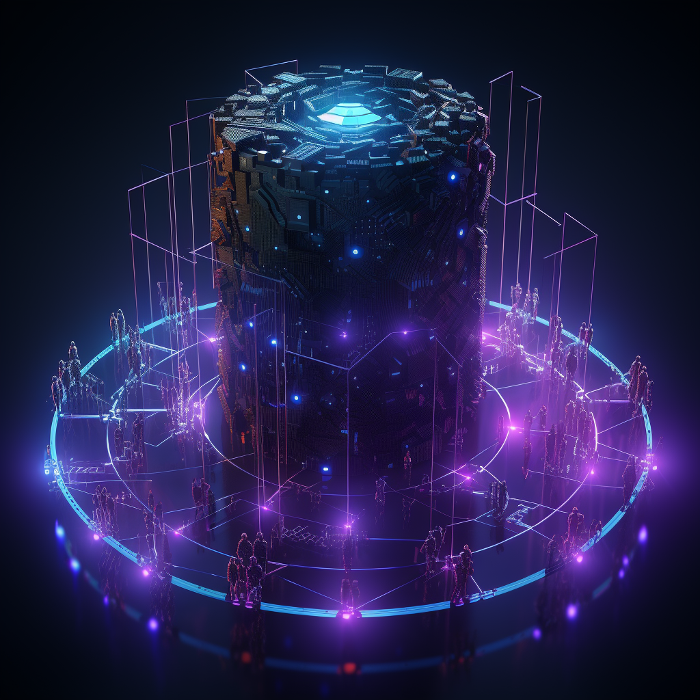

# What is PoLN ?

## A new paradigm

In the rapidly evolving landscape of today's global economy, the PoLN protocol emerges as a pioneering solution, ready to address both present and impending challenges.&#x20;

In essence, PoLN provides a cohesive blueprint for the future, effectively synergizing decentralized technologies with the fundamental principles of work and wealth distribution.&#x20;


It's not just a protocol; it's a movement towards a more equitable and efficient economic model.



The challenges posed by the traditional economy, mounting wealth inequality, overlooked expectations of newer generations, and conventional work structures demand a system overhaul.


Drawing inspiration from a poker game where a reshuffle can change the dynamics of the table, PoLN reshuffles the deck of traditional roles.&#x20;

## Reshuffled roles and new concepts

PoLN represents a profound paradigm shift in the world of work.&#x20;

Traditionally, the professional landscape has been primarily linear, with a direct pathway between an employer and an employee, or between a client, a recruiter, and a talent. This setup, although established, often confines roles and responsibilities, creating potential inefficiencies.

Moving away from the straightforward employer-employee dynamic or the classic recruiter bridging client and talent, the PoLN approach introduces a quadrant-like model, vastly more expansive and multidimensional!&#x20;

<figure><figcaption>
Actors dispatched in a new quadrant-like model
</figcaption></figure>

This quadrant framework allows for an unparalleled degree of flexibility, collaboration, and adaptability. With these distinctions, the system becomes inherently more virtuous, ensuring every participant has a clear, meaningful role and is accorded the respect and value they deserve. It promotes inclusivity, ensuring no talent is overlooked, and efficiency, by aligning the right skills and expertise with the appropriate projects.

### **Initiators**

Formerly known as clients in the traditional paradigm, initiators are project owners or entities seeking specific services or solutions.&#x20;

They bring forth tasks or projects and finance them, engaging with the PoLN protocol to find the right expertise to fulfill their objectives.

Their financial commitment to the protocol not only ensures the execution of their projects but also supports the equitable distribution of rewards among the fellowship.

### **Contractors**

Previously referred to as talents, contractors are vetted experts who perform the tasks set by the initiators.&#x20;

They possess the technical know-how and skills to execute projects and are a critical driving force behind the completion of the tasks at hand.

### **Agents**

Agents act as facilitators in the PoLN ecosystem.&#x20;

They have expertise in recruitment, business, and sales, and play a pivotal role in establishing business deals between fellowships and initiators.&#x20;

Moreover, they excel in building connections, ensuring that the right expertise is matched with the appropriate project.

### **Mentors**

Mentors are professionals with vast experience in their respective fields.&#x20;

They support contractors by providing advice, sharing knowledge, and overseeing the quality of the contractor's work.&#x20;

Mentors also play a crucial role in performing technical assessments to ensure that:

* &#x20;project standards are met and exceeded,
* the community continues to grow in its proficiency.

### **Fellowship**

<figure><figcaption>
The team collaborates, building together for the project's vision.
</figcaption></figure>

Drawing inspiration from the concept of a close-knit group like in 'The Lord of the Rings', the fellowship in the PoLN context is a cohesive unit composed of agents, contractors, and mentors.

This unit collaborates, each member playing a unique role, to ensure the successful execution of projects introduced by the initiators.&#x20;

Together, they embody the collective strength and synergy of the PoLN protocol: they bring diverse skills and experiences, fostering collaboration and amplifying results.

### **Escrow services**

Within the PoLN framework, escrow services act as trusted intermediaries that hold funds.&#x20;

They secure not only the payments from initiators meant for task completion and protocol fees but also the staked funds from fellowship members. By requiring fellowship members to stake, the system ensures they are fully invested in the success of the project, truly having "skin in the game." The staking serves as a commitment to the quality and timely delivery of their work.&#x20;

Funds from the initiators are released to the fellowships once predefined conditions or milestones are met, ensuring that the contractors deliver as promised. Conversely, the staked funds from fellowship members are returned upon successful completion of their roles, compensated fairly for their services.&#x20;

This dual-function of the escrow system reinforces trust, ensuring security for both initiators and fellowship members, and emphasizes a shared responsibility and commitment to excellence.


With this new framework, PoLN, through its dynamic fellowships and committed initiators, aspires to reshape the landscape of work, all while embodying our ten core objectives.


## Discovering PoLN through its core objectives

<figure><figcaption>
PoLN is a new paradigm
</figcaption></figure>

### **Forge a Supportive Community**

The creation of a supportive community lies at the heart of PoLN.&#x20;

Within this community, distinct fellowships of agents, contractors, and mentors drives stability and unity. These fellowships cater to the needs and expectations of initiators, ensuring the realization of their visions and projects.

### **Foster Inclusivity and Accessibility**

Inclusivity within the fellowship is championed by agents who connect diverse contractors to various initiatives.&#x20;

Mentors ensure that contractors overcome biases and obstacles, and the entire fellowship endeavors to craft an accessible economy for initiators to bring forth their projects.

### **Empower Labor**

The significant value PoLN places on individual contributions is evident...

PoLN utilizes a blockchain-based technology to empower labor, ensuring every individual's contribution is recognized and fairly compensated.&#x20;

Initiators set the foundation with their projects, agents align the right fellowship to the appropriate project, contractors bring their vetted expertise to execute, and mentors support with valuable insights and guidance.

### **Facilitate Equitable Wealth Distribution**

Wealth distribution within the PoLN ecosystem is meticulously planned.&#x20;

Fees provided by initiators are judiciously dispatched to fellowship members.&#x20;

Agents negotiate fair deals, mentors oversee that contractors' efforts are appropriately valued, and all this converges to ensure a just distribution of rewards.

### **Promote Ethical Transactions**

PoLN leverages blockchain's transparency to maintain the highest ethical standards across all economic activities, minimizing fraud and corruption.&#x20;

Initiators are encouraged to bring forth principled projects, agents maintain transparent liaisons, contractors operate with integrity, and mentors, with their vast experience, ensure that all interactions within the fellowship remain transparent and ethical.

### **Implement Secure and Rapid Crypto-Payments**

PoLN harnesses the prowess of advanced crypto solutions to achieve its overarching objectives.

By employing smart contracts, it ensures transparent, automated, and tamper-proof transactions.&#x20;

Initiators fund their projects through crypto, agents facilitate and streamline these financial exchanges, mentors offer guidance on optimal crypto practices, and contractors benefit from prompt and secure payments.&#x20;

Additionally, integrated escrow services enhance security by safeguarding funds until predetermined conditions are met, optimizing both the safety and efficiency of the wealth exchange and payment processes.

### **Enhance Stakeholder Participation**

The fellowship within PoLN emphasizes both active participation and genuine commitment.

Agents, contractors, and mentors are required to stake, ensuring they truly have skin in the game.&#x20;

Agents tirelessly forge new connections, while contractors are dedicated to delivering quality work.&#x20;

Mentors provide seasoned insights, guiding the process.&#x20;

Initiators play a pivotal role by bringing in innovative projects and are additionally incentivized with rewards upon successful completion, ensuring a win-win dynamic for all involved.

### **Community-Driven Protocol Development**

The rules and protocols of PoLN are shaped by the community's needs.&#x20;

Agents gather feedback, contractors provide insights from their on-ground experiences, mentors advise on alignment, and initiators remain adaptable, all ensuring a cohesive and adaptive protocol.

### **Drive Innovation and Modernization**

PoLN's fellowship is future-ready.&#x20;

While initiators introduce transformative projects, agents connect these with the most suitable contractors.&#x20;

Contractors bring fresh perspectives to the table, and mentors share their wisdom, ensuring the work-based economy remains at the cutting edge.

### **Strengthen Trust and Reliability**

Trust forms the bedrock of the PoLN ecosystem.&#x20;

Initiators seek reliability in results, agents strive to build lasting connections, contractors work with dedication, and mentors ensure that the quality and integrity of work are never compromised. Together, they make PoLN a beacon of trust in a decentralized work-based economy.

***


**Disclaimer:**&#x20;

PoLN protocol is not another recruitment product, it's a work-based system!

To be explicit, PoLN is not merely an application or service aiming to capitalize on the business dynamics between clients and talents. Unlike traditional recruitment platforms that profit from such interactions, fairhive-labs neither takes a cut from these relationships nor intervenes in contracts or agreements.

Instead, fairhive-labs operates as a transparent and hands-off entity, focusing on fostering genuine interactions and trust within the community.

