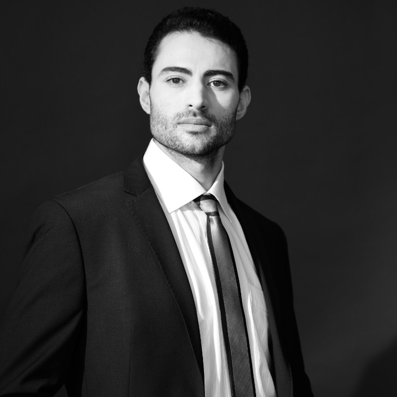

# 👥 fairhive-labs team

## CEO / CTO

<figure><figcaption></figcaption></figure>

Julien, with over 20 years of hands-on experience, stands as a beacon of innovative problem-solving. As a CTO and Architect, he excels in crafting scalable solutions using the latest technologies.

A seasoned freelance executive and the original founder of PoLN, Julien is a thought leader who has a rich history of leading major projects and scaling them effectively. He supports enterprises and startups in scaling with high resilience and data consistency.

At PoLN, he drives the protocol's evolution and charts the strategic course for fairhive-labs, leveraging his extensive investor relations experience to ensure organizational success and scalability through innovative strategies.

[https://www.linkedin.com/in/julien-sie-jsie/](https://www.linkedin.com/in/julien-sie-jsie/)

## Co-CEO / COO

<figure><figcaption></figcaption></figure>

Richard, an attentive listener, turns challenges into opportunities and business needs into solutions. An entrepreneur at heart with a digital mindset, he excels in demanding environments.

With 21 years in IT, 13 years in consulting, and 8 years in AI, FinTech, and e-commerce, he has a strong background in Consulting, Strategy, Fundraising, and Digital Transformation. He has advised many startups and is a master at forging strategic partnerships and business.

At PoLN, Richard drives operational excellence and strategic growth, leveraging his extensive experience and sales expertise to ensure the organization's success and scalability.

[https://www.linkedin.com/in/shibir/](https://www.linkedin.com/in/shibir/)
