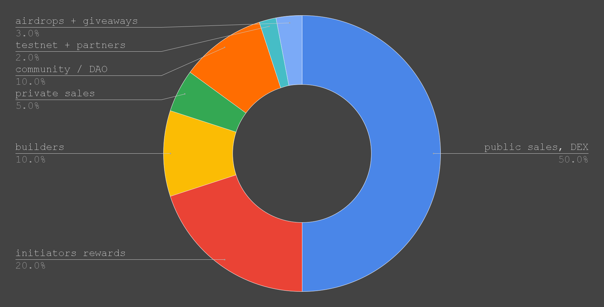

# Distribution

In the decentralized space, PoLN emerges as a pivotal protocol, bridging contractors with exciting projects and work.

By fostering an ecosystem where initiators can articulate their visions and fellowships can bring them to life, PoLN stands as a testament to the power of collective wealth creation and distribution.

Every project or piece of work undertaken fuels this dynamic ecosystem, ensuring value is both created and shared in a transparent, efficient manner.

<figure><figcaption>
PoLN's Distribution Blueprint: Beyond Numbers and Speculation
</figcaption></figure>

The following detailed breakdown elucidates the allocation priorities of the $POLN token, highlighting a dedication to forging a balanced, utility-driven ecosystem.

## Public Sales and Listings Strategy

| Tokens ($POLN) | Percentage (%) |
| :------------: | :------------: |
|  `60,000,000` |      `30`      |

The design and distribution of the $POLN token underscores PoLN's commitment to ensuring broad and decentralized access.

Such accessibility, while promoting decentralization, also seeks to discourage concentrated power within the ecosystem.

The challenge, however, is to provide widespread access while simultaneously discouraging short-term speculative behaviors.

A well-orchestrated public sales strategy—comprising both Initial DEX Offerings (IDO) and Initial Exchange Offerings (IEO)—serves as a solution. This approach not only offers immediate accessibility but also encourages long-term engagement and commitment to the PoLN ecosystem.

### Initial DEX Offering (IDO)

Embracing the ethos of decentralization and aiming for a solid introduction of $POLN in the market, the first strategic step involves an Initial DEX Offering (IDO).

This represents 20% of the public sales and listing pool, amounting to 12,000,000 $POLN.

The primary intent behind an IDO is to engage with the core DeFi community and early adopters.

Through an IDO, there's an opportunity for a fair and wide initial distribution, promoting community ownership. This method also provides a platform for organic price discovery, setting the stage for a sustainable market value of $POLN.

### Initial Exchange Offering (IEO)

Subsequent to the IDO, the plan is to expand $POLN's reach and accessibility with an Initial Exchange Offering (IEO).

This phase will use 50% of the public sales and listing pool, equating to 30,000,000 $POLN.

An IEO is a strategy to capitalize on the reputation of established centralized exchanges, crucial for presenting $POLN to a more extensive and potentially global investor base.

Centralized exchanges offer advantages in terms of promotional reach, visibility, security, seamless acquisition, and potential price stability due to the controlled token release mechanisms typical of IEOs.

### Exchange Listing

To ensure sustained accessibility, liquidity, and growth potential for $POLN, 30% of the public sales and listing pool (which is 18,000,000 $POLN) is allocated for liquidity provisions on various exchange listings.

Listing $POLN on a combination of decentralized and centralized exchanges aims to provide choice, accessibility, and smooth trading experiences to users.

Such diverse listing platforms promote a decentralized token holding pattern and, in turn, reinforce the overall ecosystem's health.

## Initiator Rewards

| Tokens ($POLN) | Percentage (%) |
| :------------: | :------------: |
|  `40,000,000`  |      `20`      |

The essence of any thriving ecosystem lies in its ability to attract and retain key participants.

For the PoLN system, these are the initiators who bring projects and collaborative opportunities to the table.

By setting aside a significant allocation for initiator rewards, the protocol emphasizes the central role that these entities play.

### Incentivizing High-Quality Proposals

One of the primary purposes of the initiator rewards is to incentivize the introduction of high-quality, viable projects to the PoLN ecosystem.

By offering tangible rewards, the protocol encourages initiators to present well-researched and feasible projects, which in turn contributes to the overall success rate and reputation of the system.

### Stimulating Ecosystem Growth

As more initiators bring projects to the protocol, there's a natural ripple effect. More projects mean more fellowships are formed, which can lead to more successful collaborations, thereby creating an upward spiral of growth and success for the entire PoLN community.

### Halving Mechanism for Longevity

The inclusion of a [halving mechanism for initiator rewards](operational-conditions/reward-fee-distribution.md#halving-mechanism-for-initiator-rewards) is both strategic and forward-thinking.

Just as Bitcoin employs halving to manage its supply and ensure longevity, PoLN uses a similar approach to ensure the rewards pool doesn't deplete rapidly.

This halving mechanism serves a dual purpose:

* **Sustainability**: The halving mechanism in the rewards structure creates an incentive for early adopters of the PoLN protocol by providing them with a larger share of rewards. As the reward size decreases over time, it extends the longevity of the pool, allowing for potentially hundreds of thousands of projects to benefit, at a minimum. While the rewards aren't infinite, this approach ensures a sustained motivation for initiators over an extended period, making it a strategic tool for both immediate and long-term growth of the PoLN ecosystem.
* **Reflecting Ecosystem Value**: As the PoLN system grows and matures, the intrinsic value of being a part of this community also rises. The halving mechanism reflects this increasing value, with the idea being that even reduced rewards in the future hold greater value due to the enhanced reputation and success rate of the system.

### Reward Scaling with Success

The structure of the rewards not only incentivizes project initiation but also ties rewards to the successful completion of projects.

This ensures that initiators remain engaged throughout the project lifecycle and are committed to seeing their projects through to successful conclusions.

## Builders (fairhive-labs)

| Tokens ($POLN) | Percentage (%) |
| :------------: | :------------: |
|  `20,000,000`  |      `10`      |

The allocation designated for the builders, primarily the fairhive-labs team, is a testament to the belief in the long-term success and viability of the PoLN protocol.

This allocation, rather than an immediate payout, is structured to align the interests of the team with the sustainable growth and evolution of the system over time.

### Two-Year Lock

Before any tokens become available, there's a two-year lock in place.

This period serves multiple purposes:

* **Commitment**: It signifies a solid pledge from the team to the protocol and its community. This isn't a short-term endeavor but a long-term vision.
* **Growth and Development Phase**: These two years represent crucial formative moments for the PoLN protocol. The team will be highly focused on development, partnerships, and user acquisition without any financial distractions.

### Vested Unlocking Over Three Years

Post the two-year lock, the tokens don't become immediately available. Instead, they are released gradually over the next three years.

The distribution is as follows:

* **Year 1 (30%)**: After the initial two-year lock, 30% of the allocated tokens become available in the third year. This initial release acknowledges the extensive work done in the foundational years and provides the team with a partial reward for their efforts.
* **Year 2 (30%)**: In the fourth year, an additional 30% is unlocked. This phase likely coincides with a maturing ecosystem, scaling operations, and growing user base.
* **Year 3 (40%)**: The remaining 40% gets unlocked in the fifth year. This more substantial portion towards the end further solidifies the long-term vision and commitment.

### Alignment with Protocol's Health

The staggered release ensures that the team remains incentivized to maintain, innovate, and grow the PoLN system throughout its early stages of development and far beyond.

### Trust & Transparency

Such a structured release strategy enhances trust within the community.

It sends a clear message that the builders are in this journey for the long haul and that their primary motivation is the protocol's success and not immediate financial gains.

## Private Sales

| Tokens ($POLN) | Percentage (%) |
| :------------: | :------------: |
|  `10,000,000`  |       `5`      |

Private sales play a pivotal role in the initial stages of a project's life cycle.

They enable projects to secure funding and support from select investors who share a mutual vision for the project's future.

For PoLN, private sales will facilitate the garnering of essential early support and capital to fuel its growth and development.

### First Round: Seed Investors

In the inaugural private sale round, the goal is to raise $1,000,000.

Investors participating in this round will be able to purchase $POLN tokens at a rate of $0.25 per token.

This offers early backers a favorable entry point, underscoring their commitment and belief in PoLN's long-term potential.

| Detail                               |       Value       |
| ------------------------------------ | :---------------: |
| **Funds to be Raised**               |    `$1,000,000`   |
| **Token Price**                      |      `$0.25`      |
| **Total Tokens Allocated**           | `4,000,000 $POLN` |
| **Percentage of Private Sales Pool** |      `40.00%`     |

### Second Round: Strategic Partners

Following the initial round, the second private sale aims to secure an additional $3,000,000.

Investors in this phase will obtain $POLN at $1 per token.

This round targets strategic partners who can not only provide capital but also bring in synergies, resources, and networks that can propel PoLN's adoption and growth.

| Detail                               |       Value       |
| ------------------------------------ | :---------------: |
| **Funds to be Raised**               |    `$3,000,000`   |
| **Token Price**                      |        `$1`       |
| **Total Tokens Allocated**           | `3,000,000 $POLN` |
| **Percentage of Private Sales Pool** |      `30.00%`     |

### Third Round: Expansion & Growth

The final private sale round seeks to raise a substantial $15,000,000.

Tokens in this phase will be priced at $5 each.

This round is designed for participants who recognize PoLN's potential for broader market expansion and are prepared to support its scaling efforts at a higher valuation.

| Detail                               |       Value       |
| ------------------------------------ | :---------------: |
| **Funds to be Raised**               |   `$15,000,000`   |
| **Token Price**                      |        `$5`       |
| **Total Tokens Allocated**           | `3,000,000 $POLN` |
| **Percentage of Private Sales Pool** |      `30.00%`     |

## Community/DAO (Treasury)

| Tokens ($POLN) | Percentage (%) |
| :------------: | :------------: |
|  `20,000,000`  |      `10`      |

The Community/DAO Treasury represents the heart of the decentralized governance model that underpins the PoLN protocol.

It's more than just a pool of funds; it's a dynamic tool that empowers the PoLN community, ensuring the protocol's resilience, growth, and adaptability in a rapidly changing ecosystem.

With a dedicated portion of the $POLN tokens set aside for this purpose, the protocol ensures that it remains responsive to the evolving needs and desires of its user base.

### Democratic Decision-Making

At its core, the treasury facilitates community voting on pivotal decisions, from protocol upgrades to partnership initiatives. Token holders can propose changes or vote on existing proposals, ensuring that the protocol's direction is truly a collective endeavor.

### Operational Expenses

The treasury funds are used to cover ongoing operational costs. This includes maintenance of the protocol, potential audits, and any other expenses that ensure the smooth functioning and security of the system.

### Grants & Funding

To foster innovation and attract talent, the treasury can allocate grants to developers and teams who wish to build on or enhance the PoLN protocol.

This ensures a steady influx of fresh ideas and solutions, keeping the protocol at the forefront of the industry.

### Liquidity & Market Stability

A portion of the treasury could be utilized to provide liquidity in various decentralized exchanges or to intervene in market operations if deemed necessary for the protocol's stability.

### Emergency Situations

In the decentralized world, unexpected situations can arise.

The treasury acts as a safety net, offering a reservoir of funds that can be tapped into during emergencies or unforeseen events.

### Community Initiatives

Beyond just technical enhancements, the protocol recognizes the value of its community.

Funds can be directed towards community initiatives, educational programs, outreach efforts, and events that strengthen the PoLN community spirit.

### Reward Programs

To motivate and retain valuable community members, the treasury can launch reward programs.

These can range from bounties for identifying bugs to rewards for outstanding community contributions.

## Testnet Development & Partners

| Tokens ($POLN) | Percentage (%) |
| :------------: | :------------: |
|   `4,000,000`  |       `2`      |

A rigorous testing phase is imperative for any protocol's success, serving as the bridge between conceptualization and real-world application.

Without such comprehensive scrutiny, even the most promising protocols might falter when exposed to real-world scenarios.

Therefore, the allocation for testnet development and partners becomes an emblematic representation of the PoLN protocol's commitment to precision, reliability, and excellence.

### Foundation of Reliability

The testnet provides a controlled environment where every aspect of the protocol can be assessed.

From minor operational glitches to significant vulnerabilities, this phase ensures that when the PoLN protocol is launched on mainnet, it operates with the reliability stakeholders expect.

### Incentivizing Quality Assurance

By allocating tokens specifically for external contributors, the protocol not only underscores its commitment to thoroughness but also leverages diverse expertise.

Such a strategy ensures the protocol is examined from all angles, enhancing its robustness.

### Fostering Collaborative Integration

The PoLN protocol's adaptability in the wider crypto ecosystem is gauged by its integrative capacities. Reserving resources for partnership integrations, the protocol prioritizes seamless interoperability, a linchpin for real-world utility and adoption.

### Risk Mitigation

Beyond just identifying bugs and vulnerabilities, a thorough testnet phase also acts as a deterrent against potential threats.

In the constantly evolving landscape of blockchain technology, adversaries are continuously on the lookout for weak points.

By making sure the protocol is watertight, the PoLN system significantly minimizes potential attack vectors.

### User Experience Optimization

The testnet allows the development team to simulate real-world usage without any actual repercussions.

This not only helps in identifying technical glitches but also provides insights into user experience (UX) optimization.

A more intuitive and user-friendly protocol will undoubtedly enjoy better adoption rates.

### Stress Testing

With the rise of DeFi and other blockchain applications, protocols can sometimes face immense loads, especially during peak times.

The testnet provides an avenue to conduct stress tests, ensuring the PoLN protocol can handle high traffic without compromising on performance.

### Feedback Loop Creation

Engaging with a community of testers and developers can create a valuable feedback loop.

This helps in gathering diverse opinions, feature suggestions, and potential improvements, allowing for iterative enhancements before the mainnet launch.

### Regulatory & Compliance Adherence

As the crypto space matures, it's increasingly interfacing with regulatory frameworks. A rigorous testnet phase can help in ensuring that the PoLN protocol is not just technically sound but also adheres to any relevant regulatory and compliance guidelines.

### Cost Efficiency

Rectifying issues post-mainnet can be a costly affair, both in terms of financial resources and reputation.

By identifying and fixing problems during the testnet phase, PoLN ensures a smoother mainnet launch, avoiding potential pitfalls and the associated costs.

## Airdrops & Giveaways

| Tokens ($POLN) | Percentage (%) |
| :------------: | :------------: |
|   `6,000,000`  |       `3`      |

The decision to allocate a portion of the $POLN supply for airdrops and giveaways highlights the protocol's commitment to fostering an engaged and supportive community from the outset.

In essence, airdrops and giveaways aren't just about distributing free tokens. They are strategic moves designed to galvanize growth, spread awareness, and build a foundation of committed users for the $POLN system.

### User Adoption Acceleration

Airdrops act as a powerful tool to attract potential users to the system.

By receiving a portion of $POLN for free, many are likely to delve deeper into what the protocol offers, thereby increasing the user base.

Moreover, airdrops to holders of specific tokens (like governance tokens of other projects) can be a strategic move to pull in users from existing communities.

### Rewarding Early Supporters

Early believers and backers of a project play a vital role in its success. Airdrops can act as a token of gratitude, strengthening the bond between the community and the protocol.

This, in turn, promotes loyalty and long-term commitment from users.

### Generating Buzz & Awareness

Giveaways, especially when combined with marketing campaigns or partnerships, can create significant buzz around the protocol.

They grab attention, encourage sharing, and can lead to organic growth through word-of-mouth, especially in the crypto community.

### Driving Network Effects

As more users become aware of and join the ecosystem due to airdrops and giveaways, the value and utility of the protocol increase.

This can lead to a virtuous cycle where increasing users enhance the network's value, which in turn attracts even more users.

***


The $POLN token distribution strategy provides an insightful look into the protocol's priorities and intentions.

Several observations can be made from the outlined tokenomics:

1. **Emphasis on Decentralization**: A significant 50% of the tokens is designated for public sales. This allocation reveals an intention for widespread distribution to avoid the pitfalls of token concentration. Such decentralization can prevent the monopolization of power and influence within the ecosystem.
2. **Business Relationship Boost**: The allocation emphasizes facilitating and nurturing business interactions between initiators and fellowships. By ensuring a substantial amount of tokens circulate within the ecosystem, the protocol aims to stimulate more transactions, potentially leading to increased collaborations and partnerships. This strategy highlights the importance of making the ecosystem vibrant and active.
3. **Mitigating Price Volatility**: The generous allocation for trading, combined with the public sales portion, has a dual purpose. Beyond fostering interactions, it's also geared towards stabilizing the token's price. Higher trading volumes are often associated with more price stability. Distributing a significant amount of tokens to the community can minimize the chances of drastic price fluctuations, fostering trust and predictability within the ecosystem.
4. **Long-Term Vision with Incentives**: Initiator rewards and the locking mechanisms for builders and private sales tokens underscore a commitment to long-term growth and sustainability. The distribution plan appears well-thought-out, safeguarding the protocol's future.
5. **Community-Centric Approach**: With allocations for airdrops, giveaways, and the community/DAO, there's a clear intention to cultivate an engaged community. The vitality of decentralized projects often rests on such a community, and this distribution caters to that.
6. **Commitment to Robust Development**: The earmark for testnet development and partner integrations indicates a significant focus on building a secure, functional, and integrated ecosystem, emphasizing not just the token but the entire infrastructure surrounding it.
7. **Balanced Incentive Structure**: The tokenomics offers a harmonious balance, incentivizing early adopters, strategic partners, the core team, and the broader user base. This equilibrium ensures that various stakeholders are aligned in their commitment to the protocol's success.
8. **Utility Over Speculation**: While tokens can naturally become speculative assets, this distribution leans heavily towards utility. The allocations are structured to encourage active ecosystem participation, be it through initiating projects, forming fellowships, or contributing to the protocol's evolution.

