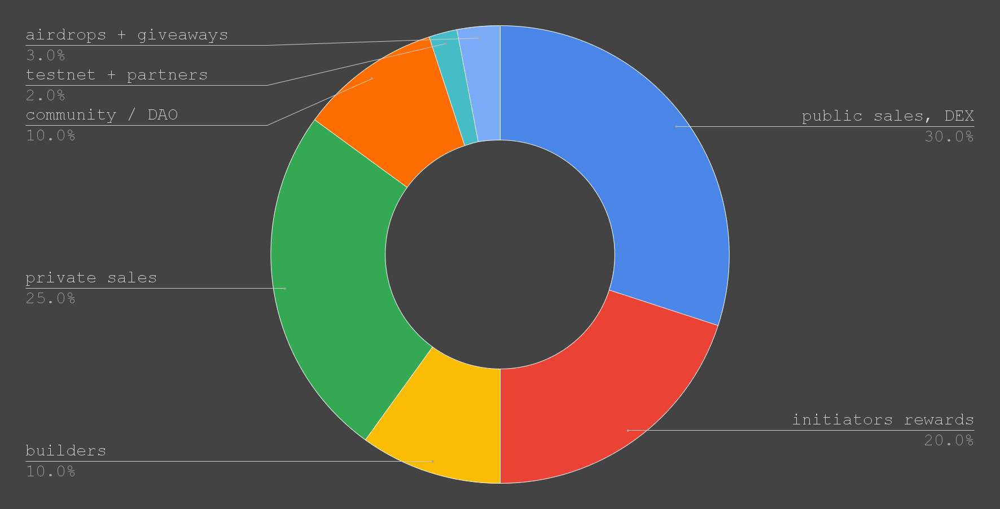

# ⛏ Distribution

In the decentralized space, PoLN emerges as a pivotal protocol, bridging contractors with exciting projects and work.&#x20;

By fostering an ecosystem where initiators can articulate their visions and fellowships can bring them to life, PoLN stands as a testament to the power of collective wealth creation and distribution.&#x20;

Every project or piece of work undertaken fuels this dynamic ecosystem, ensuring value is both created and shared in a transparent, efficient manner.

<figure><figcaption></figcaption></figure>


The $POLN token distribution strategy provides an insightful look into the protocol's priorities and intentions.&#x20;

Several observations can be made from the outlined tokenomics:

1. **Emphasis on Decentralization**: A significant 50% of the tokens is designated for public sales. This allocation reveals an intention for widespread distribution to avoid the pitfalls of token concentration. Such decentralization can prevent the monopolization of power and influence within the ecosystem.
2. **Business Relationship Boost**: The allocation emphasizes facilitating and nurturing business interactions between initiators and fellowships. By ensuring a substantial amount of tokens circulate within the ecosystem, the protocol aims to stimulate more transactions, potentially leading to increased collaborations and partnerships. This strategy highlights the importance of making the ecosystem vibrant and active.
3. **Mitigating Price Volatility**: The generous allocation for trading, combined with the public sales portion, has a dual purpose. Beyond fostering interactions, it's also geared towards stabilizing the token's price. Higher trading volumes are often associated with more price stability. Distributing a significant amount of tokens to the community can minimize the chances of drastic price fluctuations, fostering trust and predictability within the ecosystem.
4. **Long-Term Vision with Incentives**: Initiator rewards and the locking mechanisms for builders and private sales tokens underscore a commitment to long-term growth and sustainability. The distribution plan appears well-thought-out, safeguarding the protocol's future.
5. **Community-Centric Approach**: With allocations for airdrops, giveaways, and the community/DAO, there's a clear intention to cultivate an engaged community. The vitality of decentralized projects often rests on such a community, and this distribution caters to that.
6. **Commitment to Robust Development**: The earmark for testnet development and partner integrations indicates a significant focus on building a secure, functional, and integrated ecosystem, emphasizing not just the token but the entire infrastructure surrounding it.
7. **Balanced Incentive Structure**: The tokenomics offers a harmonious balance, incentivizing early adopters, strategic partners, the core team, and the broader user base. This equilibrium ensures that various stakeholders are aligned in their commitment to the protocol's success.
8. **Utility Over Speculation**: While tokens can naturally become speculative assets, this distribution leans heavily towards utility. The allocations are structured to encourage active ecosystem participation, be it through initiating projects, forming fellowships, or contributing to the protocol's evolution.


The following detailed breakdown elucidates the allocation priorities of the $POLN token, highlighting a dedication to forging a balanced, utility-driven ecosystem.

## **Public Sales**

* **Tokens:** 100,000,000 $POLN
* **Percentage:** 50%
* **Details:** Provides broad and decentralized access to $POLN. Ensures a wide user base and discourages concentrated power. It's crucial to manage the distribution to avoid short-term speculative selling and to encourage long-term engagement.

## **Initiator Rewards**

* **Tokens:** 40,000,000 $POLN
* **Percentage:** 20%
* **Details:** An incentive mechanism to attract more projects and collaborations. Rewards for successful project launches, with a halving mechanism to ensure sustainability and reflect the increasing value of the ecosystem.

## **Builders (fairhive-labs)**

* **Tokens:** 20,000,000 $POLN
* **Percentage:** 10%
* **Details:** Aligns the team's interests with the protocol's success. By locking these tokens, it assures the community of the team's long-term commitment.

## **Private Sales**

* **Tokens:** 10,000,000 $POLN
* **Percentage:** 5%
* **Details:** Targets strategic partners offering more than capital. Locking mechanism ensures commitment and prevents early token selling.

## **Community/DAO (Treasury)**

* **Tokens:** 20,000,000 $POLN
* **Percentage:** 10%
* **Details:** Fuels community-driven growth and allows for democratic decision-making regarding fund usage.

## **Testnet Development & Partners**

| Tokens ($POLN) | Percentage (%) |
| :------------: | :------------: |
|   `4,000,000`  |       `2`      |

### **Details**

Dedicated to ensuring a rigorous testing phase for the protocol before the mainnet launch. The testnet offers a sandboxed environment to identify potential vulnerabilities, ensure integrations run smoothly, and refine the system's functionalities.

The allocation for testnet development goes beyond just its creation. Recognizing the importance of community and external expertise in this phase, there's a provision to offer incentives for contributors. These incentives serve as a motivation for developers and testers to actively engage, thereby ensuring a comprehensive and thorough testing process.

Partner integrations also play a crucial role in widening the protocol's reach and functionality. Collaborations with potential partners are essential to ensure seamless interoperability and drive wider adoption once the mainnet goes live.

## **Airdrops & Giveaways**

* **Tokens:** 6,000,000 $POLN
* **Percentage:** 3%
* **Details:** Promotes user adoption and rewards early supporters. Essential for building a strong initial community and driving network effects.
